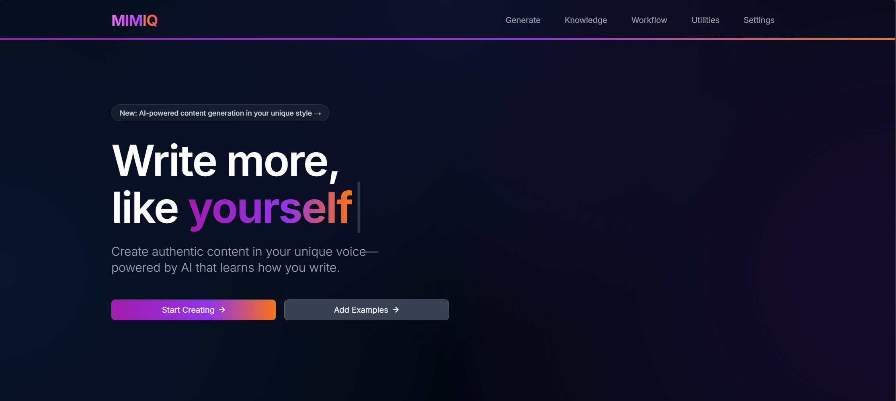
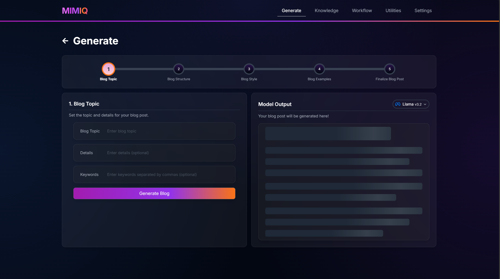

# MIMIQ

MIMIQ is an AI-powered content generation platform that helps businesses maintain their unique voice across various media. By analyzing existing content and leveraging local large language models, MIMIQ enables non-technical users to create stylistically consistent blog posts, newsletters, and other content that matches their brand's tone and style.

## Key Features

- **Style Analysis**: Analyzes existing content to understand and replicate your brand's unique voice
- **Local AI Processing**: Powered by Ollama for privacy-focused, local LLM processing
- **User-Friendly Interface**: Designed for non-technical users to easily generate content
- **Multi-Step Pipeline**: Sophisticated AI workflow for context-aware content generation
- **Content Variety**: Generate blog posts, newsletters, and other media types

## Tech Stack

- **Frontend**: React
- **Backend**: FastAPI
- **AI Framework**: LangChain
- **LLM Integration**: Ollama, LM Studio, OpenAI

## Getting Started

MIMIQ is not yet ready for public use.

## Screenshots

<!-- 
To get started with MIMIQ, follow these steps:

1. Clone the repository
2. Install dependencies
3. Set up Ollama for local LLM processing
4. Run the development server
-->

<!-- ## Contributing

Contributions are welcome! Please feel free to submit a Pull Request.

## License

This project is licensed under the MIT License - see the LICENSE file for details. -->

